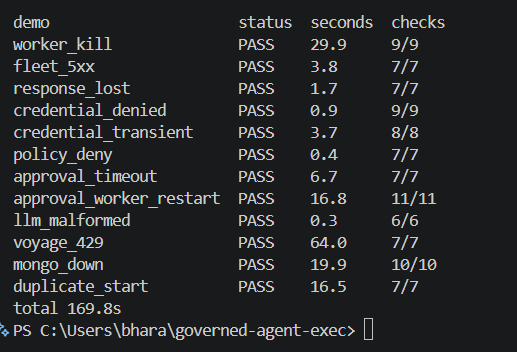
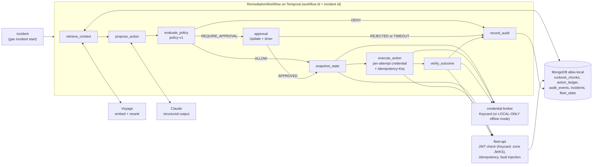
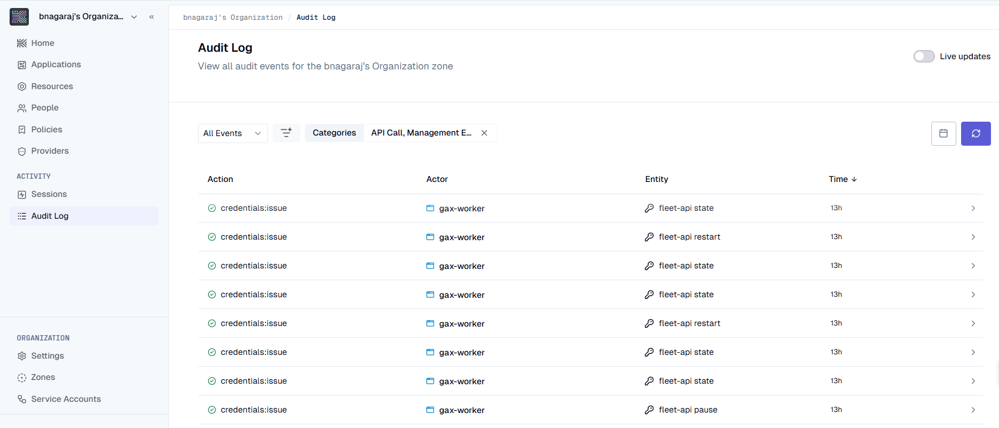
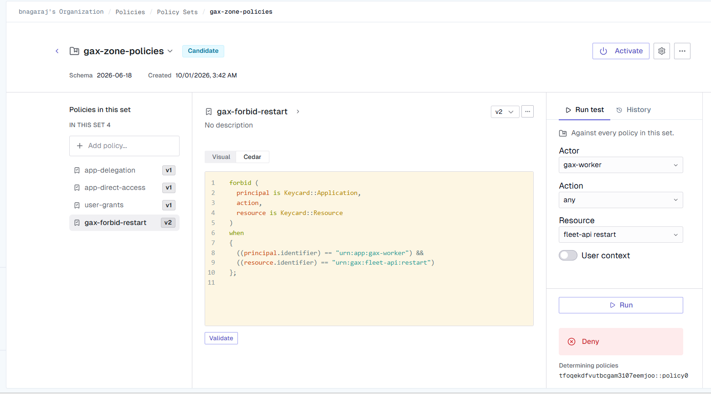
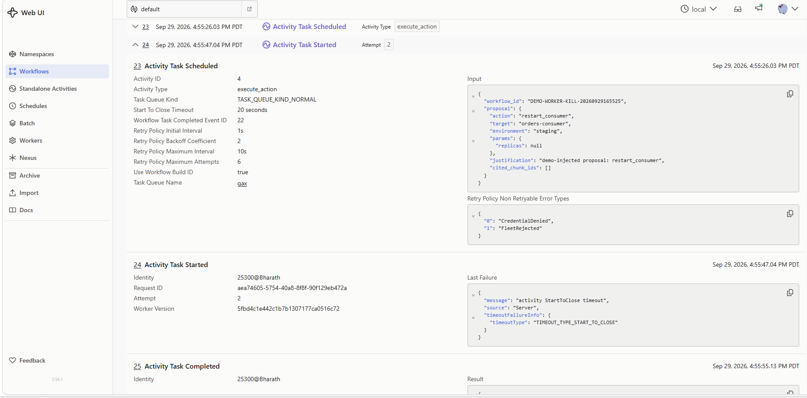
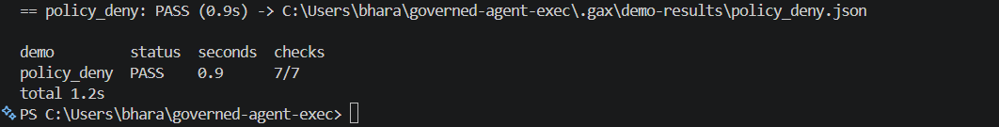

# Durable & Governed Agent Execution

## At a glance

- Claude proposes incident-remediation actions; deterministic, versioned policy decides; Temporal executes them durably with per-attempt credentials, idempotency keys, outcome verification and an audit record.
- The credential layer is real Keycard: every activity attempt mints its own client-credentials token (60 s lifetime), and fleet-api verifies it against the Keycard zone JWKS. LOCAL-ONLY (locally signed JWTs) is kept as an explicit offline mode, chosen with `CREDENTIAL_MODE` ([ADR 0002](docs/decisions/0002-keycard-integration.md)).
- 12/12 failure demos (worker kill, lost response, revoked credential, Mongo down and more) pass in one live `gax demo run all` in **both** modes: LOCAL-ONLY on 2026-09-29 ([docs/evidence/](docs/evidence/)) and KEYCARD on 2026-10-01 ([docs/evidence/keycard/](docs/evidence/keycard/)).
- 162 tests (unit and integration, pytest), plus 5 opt-in live Keycard tests (`KEYCARD_LIVE=1`).
- Stack: Temporal, MongoDB atlas-local with Vector Search, Voyage AI (embed and rerank), Claude (structured output), Keycard, FastAPI, Python 3.12.
- Personal project, September to October 2026. The stack runs locally; Claude, Voyage and Keycard are called as hosted services.



*`gax demo run all` in LOCAL-ONLY mode on 2026-09-29: all 12 failure demos PASS with every check passing, 169.8 s total. The KEYCARD-mode run on 2026-10-01 also passed 12/12 (310.9 s); its results are in [docs/evidence/keycard/](docs/evidence/keycard/).*

An LLM is good at reading an incident and proposing a fix. It should not be the thing that decides whether the fix runs, holds the credentials, or is trusted to have done it exactly once. In this project, Claude proposes a remediation action for a simulated streaming platform. Deterministic, versioned policy code decides whether the action is allowed, needs a human approval, or is denied. Temporal executes it durably: each attempt gets its own short-lived credential, minted by Keycard and verified by the target system, and sends an `Idempotency-Key`, so a crash or a lost response cannot apply it twice. The result is then verified against the target system's state and written to an audit record. Retrieval (Voyage embeddings and rerank over MongoDB vector search) only gives the proposer context. It never authorizes anything.

## How this project started

On 2026-09-15 I attended "Builder After Hours: Durable Agents with MongoDB, Temporal & Keycard" in San Francisco, a developer meetup with speakers from MongoDB, Temporal and Keycard. The talks showed durable ingestion with Temporal, Voyage and MongoDB Atlas. They killed a worker without losing the workflow. Keycard minted per-activity credentials through a Temporal interceptor. A Cedar policy denied the worker's MongoDB credential live. A versioned knowledge index was switched with an active pointer.

Afterwards I checked the current docs, found the public reference repo [mongodb-developer/mdb-temporal-keycard](https://github.com/mongodb-developer/mdb-temporal-keycard), and ran verification spikes ([docs/m0-findings.md](docs/m0-findings.md)).

The event's examples ingest data and read it. This repo governs **write** actions instead. It has parameter-level policy, human approval with a durable timeout, idempotent side effects with a per-attempt ledger, outcome verification, and 12 live failure demos.

| Event concept | This repo | Evidence |
|---|---|---|
| Worker-kill recovery | `execute_action` retried on a new worker, applied once | demos `worker_kill`, `approval_worker_restart` |
| LLM calls as activities | `propose_action` is a Temporal activity | `test_staging_restart_verified_once_and_no_credential_in_history`; [m1-findings Part 2](docs/m1-findings.md#part-2-remediationworkflow) |
| Content-hash idempotent ingestion | sha256 per chunk; unchanged chunks skipped | `test_ingest_skips_unchanged_and_search_finds_runbook`; [m1-findings Part 1](docs/m1-findings.md#part-1-retrieval) |
| Voyage embed + rerank on vector search | Runbook retrieval for the proposer | [m1-findings Part 1](docs/m1-findings.md#part-1-retrieval); demo `voyage_429` |
| Deterministic deny-by-default policy | Deterministic `policy-v1` table. Nothing is allowed by default: unknown actions fail schema validation (NEEDS_HUMAN), and missing or out-of-range params are DENY | `test_table_cells`, `test_scale_boundaries`, `test_deterministic`; demos `policy_deny`, `llm_malformed` |
| Per-activity short-lived credentials | Fresh Keycard client-credentials token (60 s) per activity attempt, minted by our own broker inside the activity, not by the `@grant` interceptor; LOCAL-ONLY JWTs in offline mode | 5 live Keycard tests; demo `credential_transient` and all 12 demos in the [KEYCARD run](docs/failure-semantics.md#observed-run-keycard-mode); `test_short_ttl_expires_in_real_time` |
| Policy denial at execution time | A Cedar forbid, activated as a Keycard policy set in the console, makes the `execute_action` mint fail non-retryably | demo `credential_denied` ([KEYCARD run](docs/failure-semantics.md#observed-run-keycard-mode)); `test_revoke_denies_and_restore_allows` (LOCAL-ONLY) |
| Keycard | **Integrated** 2026-10-01 | [ADR 0002](docs/decisions/0002-keycard-integration.md) (ACCEPTED); K3 run: [failure-semantics](docs/failure-semantics.md#observed-run-keycard-mode), [docs/evidence/keycard/](docs/evidence/keycard/) |
| Blue/green embedding migration | **Not implemented**; `retrieval_config` holds a `v1` active pointer only | `src/gax/retrieval/store.py` (`set_active`, `get_active`) |

Independent personal project; not affiliated with or endorsed by MongoDB, Temporal, or Keycard.

## Architecture



Temporal history is the authority on execution. MongoDB holds retrieval data, domain state, the per-attempt `action_ledger` and the audit projection. fleet-api is a separate FastAPI process with its own state that stands in for the system being remediated. The LLM never sees credentials. Design: [docs/design.md](docs/design.md).

## Why each component exists

| Component | Role | Failure it protects against | Proven by |
|---|---|---|---|
| Temporal | Durable workflow, retries, approval timer | Worker crash mid-action or during an approval wait; approval waits with no deadline; duplicate runs for one incident | demos `worker_kill`, `approval_worker_restart`, `approval_timeout`, `duplicate_start`; `test_approval_timeout`, `test_duplicate_start_rejected` |
| MongoDB (atlas-local) | Vector index, action ledger, audit, fleet-api state and idempotency store | Losing per-attempt evidence (Temporal history keeps only the final attempt); no audit trail | demos `worker_kill` (ledger `[PENDING, REPLAYED]`), `mongo_down`; `test_ingest_skips_unchanged_and_search_finds_runbook` |
| Voyage | Embeddings and rerank for runbook retrieval | Proposer working without relevant runbooks; free-tier 429s | demo `voyage_429`; `test_429_backs_off_exponentially_then_succeeds`, `test_limiter_enforces_rpm`; rerank ordering in [m1-findings](docs/m1-findings.md) |
| Claude | Proposes one `ActionProposal` (Pydantic-validated structured output) | Free-text or out-of-schema actions reaching execution | demo `llm_malformed`; `test_malformed_proposal_needs_human_after_three_bounded_attempts`, `test_malformed_proposal` |
| Policy layer | Deterministic ALLOW / REQUIRE_APPROVAL / DENY by action, environment and parameters | An LLM-proposed destructive or out-of-range action being executed | demo `policy_deny`; `test_table_cells`, `test_scale_boundaries`, `test_policy_deny_schedules_no_execute_action` |
| Credential broker (Keycard; LOCAL-ONLY offline mode) | Keycard token per activity attempt, one resource per action, never stored in workflow state | Acting after access is revoked; credentials leaking into history, logs or the LLM | demo `credential_denied` in KEYCARD mode (a real policy-set flip; the `access_denied` error names policy `gax-forbid-restart`); 5 live Keycard tests (mint and JWKS verification per resource); demo `credential_transient`; `test_staging_restart_verified_once_and_no_credential_in_history`, `test_revoke_denies_and_restore_allows` |
| fleet-api | Simulated target system with `Idempotency-Key`, JWT validation (Keycard zone JWKS, or the local key offline) and fault injection | Double-applying a non-idempotent action on retry or after a lost response | demos `fleet_5xx`, `response_lost`; `test_idempotency_dedupe`, `test_concurrent_duplicates_apply_once`, `test_commit_then_drop_applies_exactly_once` |



*Keycard console screenshot, Audit Log: `credentials:issue` events with actor `gax-worker` for the `fleet-api state`, `fleet-api restart` and `fleet-api pause` resources, each marked successful.*

## Design decisions I made

- **Two authorization layers, not a credential issuer alone.** Versioned policy code decides on action, environment and parameters; a per-attempt credential decides who may call fleet-api at all. Rejected: relying on the credential issuer only, because it never sees the proposal and cannot express "`scale_consumer` only for 1..10 replicas" or "DENY in prod". [ADR 0001](docs/decisions/0001-authorization-layering.md)
- **Keycard behind our own broker interface, not the `@grant` interceptor.** `KeycardCredentialBroker` implements the same `issue()` as the LOCAL-ONLY broker and is called inside the activity body. Rejected: `keycardai-temporal`'s `@grant`, because it mints in a worker interceptor before the activity body runs, so a denied or transient mint would never write its `CREDENTIAL_DENIED` / `CREDENTIAL_UNAVAILABLE` ledger row. Those rows are the evidence for the credential demos. [ADR 0002 §1](docs/decisions/0002-keycard-integration.md#1-a-broker-behind-the-existing-interface-not-grant); [keycard-findings §2.1](docs/keycard-findings.md#21-grant-and-obtaining-the-credential)
- **One Keycard resource per action.** `urn:gax:fleet-api:{state,restart,scale,pause,reset-offset}`, each with a 1m credential lifetime. A client-credentials token has no `scope` or `target` claim, so its `aud` is the only claim that can carry the action, and fleet-api pins `aud` to the route. Per-action resources also make per-action Cedar policy possible. Rejected: one fleet-api resource, which would lose the action check. [ADR 0002 §2](docs/decisions/0002-keycard-integration.md#2-one-urn-resource-per-action); [keycard-findings §8.2](docs/keycard-findings.md#82-minting-and-claims-verified-live)
- **`invalid_target` maps to denied, although the SDK marks it retryable.** Live, it meant "unknown resource", which no retry can fix. `access_denied`, `insufficient_authorization` and `invalid_client` are also non-retryable `CredentialDenied`; 429, 5xx and network errors are retryable `CredentialUnavailable`. [ADR 0002 §3](docs/decisions/0002-keycard-integration.md#3-error-mapping); [keycard-findings §8.3](docs/keycard-findings.md#83-denials-verified-live)
- **LOCAL-ONLY kept as an explicit offline mode.** `CREDENTIAL_MODE` is `local-only` (default) or `keycard`. Both the worker's `build_broker` and fleet-api refuse to start when `KEYCARD_ZONE_URL` is set and `CREDENTIAL_MODE` is not, so LOCAL-ONLY is never chosen silently. Ledger and audit records carry `credential_mode`. Rejected: dropping the offline mode, because the tests and demos must also run without a Keycard zone. [ADR 0002 §4](docs/decisions/0002-keycard-integration.md#4-explicit-mode-switch)
- **One structured proposal per incident, not an agent framework.** `propose_action` is a single Temporal activity that returns one Pydantic-validated `ActionProposal`, with bounded retries and then NEEDS_HUMAN. Rejected: multi-agent setups, listed as out of scope in [docs/design.md](docs/design.md#out-of-scope-until-m1-and-m2-pass). Demo `llm_malformed` shows an out-of-schema action stopping before any fleet request.
- **A per-attempt ledger next to Temporal history.** Every `execute_action` attempt writes its own `action_ledger` row. Rejected: relying on history alone, because it records only the final attempt's `ActivityTaskStarted`, so a killed attempt appears only as `lastFailure`. [m0-findings finding 2](docs/m0-findings.md#findings); demo `worker_kill` (ledger `[PENDING, REPLAYED]`).
- **Idempotency key per incident id.** `execute_action` sends `<workflow_id>:execute_action`, and fleet-api stores the response in the same Mongo transaction as the state change. Rejected for now: a per-run key, which would let a rerun of a failed incident apply the action again. [failure-semantics "Idempotency"](docs/failure-semantics.md#idempotency)
- **Retrieval failure proceeds without context.** The workflow records `retrieval_error` and proposes with an empty context, and policy still gates the action. Rejected: failing the run, because retrieval is supporting context and never authorizes anything. [src/gax/workflows.py](src/gax/workflows.py#L88-L95); `test_retrieval_error_proposes_with_empty_context_and_policy_still_gates` in [tests/integration/test_remediation_workflow.py](tests/integration/test_remediation_workflow.py).
- **Self-verifying failure demos on the live stack, not only mocks.** Each demo injects its fault and checks Temporal history, the ledger, fleet-api counters and the worker log. Rejected: mock-only failure tests; the mock-transport test missed the server's "Failure exceeds size limit." truncation that the live demo exposed. [failure-semantics finding 1](docs/failure-semantics.md#findings)
- **Blue/green embedding migration deferred.** `retrieval_config` holds a single `v1` active pointer and nothing switches versions. Rejected for now: building the migration, because the thesis is governed execution and retrieval is supporting context ([docs/design.md](docs/design.md#thesis)). `src/gax/retrieval/store.py` (`set_active`, `get_active`).

## Failure matrix

Each row is a demo that runs against the live stack and checks its evidence (Temporal history, ledger, fleet-api counters, fleet state, worker log). Every demo also scans its workflow histories and worker log for credential material. Full details are in [docs/failure-semantics.md](docs/failure-semantics.md). Two recorded `gax demo run all` runs passed 12/12:

- **LOCAL-ONLY**, 2026-09-29: 169.8 s ([Observed run](docs/failure-semantics.md#observed-run); [docs/evidence/](docs/evidence/), with `policy_deny.json` from a standalone rerun the same day).
- **KEYCARD**, 2026-10-01: 310.9 s, every credential a real Keycard token verified by fleet-api against the zone JWKS. Each demo also checked that its ledger rows carry `credential_mode` `KEYCARD` and that fleet-api reports `auth_mode` `KEYCARD` ([Observed run: KEYCARD mode](docs/failure-semantics.md#observed-run-keycard-mode); [docs/evidence/keycard/](docs/evidence/keycard/)).

The observed values below held in both runs unless the row says otherwise.

| Demo | What breaks | What the system does | Observed |
|---|---|---|---|
| `worker_kill` | Worker process hard-killed while `execute_action` is in flight | Temporal times out the attempt and retries on a new worker with the same Idempotency-Key | lastFailure `activity StartToClose timeout`, ledger `[PENDING, REPLAYED]`, `restart_count` 0 → 1 |
| `fleet_5xx` | fleet-api returns 500 twice | Retryable `FleetUnavailable` | ledger `[HTTP_500, HTTP_500, APPLIED]`, one state change |
| `response_lost` | fleet-api commits, then drops the response | Retry with the same key; fleet-api replays the stored response | ledger `[TRANSPORT_ERROR, REPLAYED]`, `restart_count` 0 → 1 |
| `credential_denied` | KEYCARD: the operator activates the `gax-zone-policies` policy set (a Cedar forbid on gax-worker × `restart`) in the Keycard console while the demo probes with real mints. LOCAL-ONLY: grant revoked locally | Keycard returns `access_denied`; non-retryable `CredentialDenied`, run ends CREDENTIAL_DENIED; after `default-zone-policies` is re-activated, the same incident id reruns | 1 attempt, 0 restart requests; KEYCARD ledger error names policy `gax-forbid-restart` in version 3 of `gax-zone-policies`; rerun VERIFIED |
| `credential_transient` | Credential issuance unavailable twice. In KEYCARD mode this is **SIMULATED** in front of a real mint (Keycard has no fault injection) | Retryable; credential requested fresh on every attempt | ledger `[CREDENTIAL_UNAVAILABLE ×2, APPLIED]`, 1 restart request; KEYCARD lastFailure `SIMULATED transient failure in front of KEYCARD`, attempt 3 minted a real token |
| `policy_deny` | LLM-style proposal: prod `reset_consumer_offset` | Policy DENY before any fleet call | DENIED, fleet counters `{}`, prod offset 1000 → 1000 |
| `approval_timeout` | Nobody approves `pause_pipeline` | Durable timer ends APPROVAL_TIMEOUT; late approval rejected | nothing executed; reject path executes nothing; approve path executes once |
| `approval_worker_restart` | Worker process hard-killed while `pause_pipeline` awaits approval | A new worker replays history and accepts the approval Update | Update accepted on the new worker's pid, nothing re-proposed, ledger `[APPLIED]`, `pause_pipeline=1`, audit record, VERIFIED |
| `llm_malformed` | Proposal with action `drop_topic` | Pydantic validation fails, run ends NEEDS_HUMAN | 0 fleet requests |
| `voyage_429` | Voyage free-tier rate limit exhausted | Client backoff 2/4/8 s plus a sliding-window limiter | real 429s, then embed and rerank 200, run VERIFIED |
| `mongo_down` | atlas-local stopped after approval | Mongo errors become compact retryable `MongoUnavailable` | `snapshot_state` retried (attempt 3 LOCAL-ONLY, 4 KEYCARD), then VERIFIED with an audit record |
| `duplicate_start` | Same incident id started while running and after completion | `ALLOW_DUPLICATE_FAILED_ONLY` rejects both | exit 2 twice, one run, one state change |



*Keycard console screenshot, the forbid behind `credential_denied`: the `gax-forbid-restart` Cedar rule in the `gax-zone-policies` set matches `principal.identifier` `"urn:app:gax-worker"` and `resource.identifier` `"urn:gax:fleet-api:restart"`; the set-level Run test for gax-worker × fleet-api restart returns Deny, determining policy `<set-id>::policy0`. The set shows Candidate status here (not active); the demo activates it.*



*`worker_kill` in the Temporal UI (workflow `DEMO-WORKER-KILL-20260929165525`): `execute_action` attempt 2 started on the new worker (pid 25300) with lastFailure `activity StartToClose timeout` left by the killed attempt 1.*



*Standalone `gax demo run policy_deny` rerun on 2026-09-29: PASS, 7/7 checks, 0.9 s.*

## Quickstart

Prerequisites: Windows with PowerShell, Python 3.12 with a venv at `.venv`, Docker Desktop, Temporal CLI (set `TEMPORAL_CLI` or put `temporal` on PATH).

`.env` (copy `.env.example`; values are never committed):

| Name | Needed for |
|---|---|
| `CREDENTIAL_MODE` | `local-only` (default) or `keycard`. Must be set explicitly once `KEYCARD_ZONE_URL` is filled in, or the worker and fleet-api refuse to start. |
| `LOCAL_BROKER_SIGNING_KEY` | Required in `local-only` mode. At least 32 bytes. Signs and verifies LOCAL-ONLY credentials. |
| `VOYAGE_API_KEY`, `VOYAGE_BASE_URL` | Ingest, search, retrieval, `voyage_429` demo. Atlas-issued keys only work with `https://ai.mongodb.com/v1`. |
| `ANTHROPIC_API_KEY`, `ANTHROPIC_MODEL` | LLM proposals. Model defaults to `claude-sonnet-5`. |
| `KEYCARD_ZONE_URL`, `KEYCARD_CLIENT_ID`, `KEYCARD_CLIENT_SECRET` | Required in `keycard` mode; the worker fails fast naming any that are empty. fleet-api pins the zone URL as the token issuer and fetches its JWKS. |
| `KEYCARD_RESOURCE_PREFIX` | Optional. Prefix of the per-action resource URNs, default `urn:gax:fleet-api`. |

Keycard setup (only for `keycard` mode): in the Keycard console, create an application with credential type "Client ID & Secret" and put its client ID and secret in `.env`. Create five resources, `urn:gax:fleet-api:state`, `:restart`, `:scale`, `:pause` and `:reset-offset`, with the "Zone Provider (Keycard STS)" credential provider and a 1m Credential Lifetime, and add each as a dependency of the application. For the `credential_denied` demo, duplicate the read-only `default-zone-policies` set as `gax-zone-policies` and add the attribute-matching forbid on `restart`. Details: [keycard-findings §7](docs/keycard-findings.md#7-k1-console-setup-in-progress-2026-09-30) and [§8.4](docs/keycard-findings.md#84-console-policy-behaviour-verified-console).

```powershell
.venv\Scripts\python.exe -m pip install -e ".[dev]"
.\scripts\start-stack.ps1 -WithWorker
.venv\Scripts\gax.exe ingest
.venv\Scripts\gax.exe incident start --id INC-1 --env staging --target orders-consumer --summary "orders-consumer has 0 active members, lag climbing" --wait
.venv\Scripts\gax.exe audit INC-1
.venv\Scripts\gax.exe demo run all
.\scripts\stop-stack.ps1
```

- `start-stack.ps1` starts atlas-local (Docker), the Temporal dev server, fleet-api and, with `-WithWorker`, the worker. It prints the `auth_mode` fleet-api reports, and the worker prints its `credential_mode`. Temporal UI: http://localhost:8233.
- A second `ingest` embeds nothing: unchanged chunks are skipped by content hash.
- `demo run all` runs the twelve failure demos. The demos inject their proposals and skip retrieval, so they make no LLM or Voyage calls. The exception is `voyage_429`, which calls Voyage. Results go to `.gax/demo-results/`; sanitized copies from the recorded run are in [docs/evidence/](docs/evidence/).
- `stop-stack.ps1` stops the worker, fleet-api, Temporal and the container.

Other commands: `gax search "<query>"`, `gax status <id>`, `gax approve|reject <id> --by <name>`, `gax broker revoke|restore|transient --action <action>`, `gax fleet faults|counters|reset|state`, `gax demo list`. `scripts\start-worker.ps1` and `scripts\stop-worker.ps1` manage the worker on its own (log `.gax\logs\worker.log`, launcher and real PID in `.gax\pids\worker.pid`). Tests: `.venv\Scripts\python.exe -m pytest`. The integration tests need atlas-local on `localhost:27017`. The live Keycard tests mint 5 real tokens and run only with `$env:KEYCARD_LIVE = "1"`. In `keycard` mode, `gax broker revoke|restore` refuse and point to the console policy-set flip; `gax broker transient` still works and is labelled SIMULATED.

## Key engineering findings

- **Oversized activity failures were found only by the live demos.** The Temporal server replaced lastFailure with `"Failure exceeds size limit."` because the Python SDK serialized the full httpcore → httpx exception chain (and pymongo's `ServerSelectionTimeoutError`). The mock-transport integration test did not reproduce it. The fix is to raise transport errors `from None` and turn Mongo errors into a compact `MongoUnavailable`. See [failure-semantics finding 1](docs/failure-semantics.md#findings).
- **An idempotency key and a ledger are both needed.** Temporal history records only the final attempt's `ActivityTaskStarted`. A killed attempt shows up only as `lastFailure` on the next one. So every attempt writes its own `action_ledger` row, and fleet-api stores the response under `<workflow_id>:execute_action` in the same Mongo transaction as the state change. See [m0-findings finding 2](docs/m0-findings.md#findings) and demos `worker_kill` and `response_lost`.
- **Authorization has two layers.** A credential issuer decides who may get a token for a resource. It never sees the proposal, so it cannot express "`scale_consumer` only for 1..10 replicas" or "DENY in prod, approval in staging". Those rules are in versioned policy code. The credential is re-issued on every attempt, so a revocation stops the next retry. See [ADR 0001](docs/decisions/0001-authorization-layering.md).
- **The Keycard JWKS endpoint returned 403 to the default Python User-Agent.** PyJWT's `PyJWKClient` sends `Python-urllib/...` and got HTTP 403; the same request with an explicit `User-Agent` header got 200. fleet-api's verifier sets the header. See [keycard-findings §8.1](docs/keycard-findings.md#81-discovery-and-jwks-verified-live).
- **Cedar entity IDs are internal IDs, not the identifiers shown in the console.** A forbid on `Keycard::Application::"urn:app:gax-worker"` did not match, and the policy test stayed Allow. A forbid that matches the `principal.identifier` and `resource.identifier` attributes works, and it is the one the `credential_denied` demo activates. See [keycard-findings §8.4](docs/keycard-findings.md#84-console-policy-behaviour-verified-console).
- **The secret scan had to be widened for Keycard tokens.** It matched only the `eyJhbGciOi` prefix, which assumes the JWT header serializes `alg` first. A Keycard RS256 header need not start that way, so the demo and test scans now match any JWT shape (`eyJ<header>.eyJ<payload>.<signature>`) and `Bearer <token>`, with a unit test for a `kid`-first header. See [keycard-findings §9.4](docs/keycard-findings.md#94-fixes-found-in-k3).
- **Windows process-handle inheritance hung the start script.** `Start-Process -RedirectStandardOutput` made the detached Temporal and fleet-api processes inherit the caller's pipe, so a piped `start-stack.ps1` never returned. They are now launched through `cmd.exe /c ... 1>out 2>err`, which inherits no handles. See [m1-findings Part 0](docs/m1-findings.md#part-0). A related trap: `.venv\Scripts\python.exe` is a launcher, so kill demos target the real PID the worker prints.

## Limitations and what I would change for production

- **Keycard tokens carry no environment or target binding.** A client-credentials token carries only the action, through `aud`. A `:restart` token is accepted for `prod/payments-consumer` as well as `staging/orders-consumer` (pinned by `test_no_environment_or_target_binding_in_keycard_mode`). Policy still decides action, target, environment and parameters before `execute_action` runs. Restoring the binding would need per-environment resources or a token exchange with custom claims. See [ADR 0002 Limitations](docs/decisions/0002-keycard-integration.md#limitations).
- **Revocation is a manual console flip.** Revoke means activating the `gax-zone-policies` policy set in the Keycard console; restore means re-activating `default-zone-policies`. It is not automated.
- **Policy-set flip time-to-effect is not measured.** The K3 run gives only upper bounds that include operator time: 33.7 s from the revoke prompt to the first denied probe, and 53.4 s from the restore prompt to the first issued probe ([keycard-findings §9.2](docs/keycard-findings.md#92-policy-set-flip-timing-verified-live-upper-bounds-only)).
- **Tokens stay valid until `exp` after a revoke**, according to the Keycard docs. With a 1m lifetime that window is at most 60 s. This was not tested live.
- **The Keycard transient failure is simulated.** Keycard has no fault injection, so `credential_transient` raises the retryable error in front of the real mint and labels it SIMULATED in history, logs and the demo result.
- **Every `issue()` is a billed Keycard transaction.** Snapshot, execute and verify mint separately, so one successful remediation costs at least 3 mints. The KEYCARD demo run made 46 mints.
- **Single-node atlas-local and the Temporal dev server** (SQLite file under `.gax/`). There is no replication, HA or persistence tuning.
- **fleet-api `/admin/*` endpoints are unauthenticated.** They exist for fault injection and resets, and only listen on `127.0.0.1`.
- **The corpus is synthetic.** It has 14 invented runbooks and 54 chunks ([corpus/README.md](corpus/README.md)).
- **Failed retrieval does not stop the run, by design.** The workflow records `retrieval_error` and proposes without context. Policy still gates the action. An integration test covers this with a test double (`test_retrieval_error_proposes_with_empty_context_and_policy_still_gates`); no live demo forces a retrieval failure.
- **The idempotency key is scoped to the incident id, not the run.** Rerunning a failed incident id whose action already committed replays the stored response instead of applying again.
- **atlas-local exits with code 137 on `docker stop`**, even though the stop returns in about 3 s. The cause was not investigated.
- **Not verified** (from the findings docs): malformed output from the real model (structured outputs constrain decoding, so the bounded-retry path is covered by a test double); Mongo down during or after `execute_action`'s commit, or during `record_audit`; Mongo down for longer than the retry budget; a worker kill before the request reaches fleet-api; a Temporal server crash; activity heartbeating; Keycard policy-set flip time-to-effect; whether a Keycard token issued before a forbid stays valid until `exp`.

For production I would bind Keycard tokens to environment and target (per-environment resources or a token exchange with custom claims) and automate revocation instead of flipping policy sets in the console. I would also run a replicated MongoDB and a real Temporal cluster, authenticate the admin endpoints (or remove them), and scope idempotency keys per run where re-execution after a failed run is intended.

## Credit

This project was inspired by concepts from [mongodb-developer/mdb-temporal-keycard](https://github.com/mongodb-developer/mdb-temporal-keycard). That reference architecture combines Temporal, MongoDB Atlas, Voyage and Keycard for a durable RAG ingestion pipeline and a read-only research agent, with per-activity just-in-time credentials. How this project differs is described in [How this project started](#how-this-project-started).

Thanks to Keycard for private-beta access, which made the Keycard integration possible.

## Status

This is a personal project, built in September and October 2026. The stack runs locally. Keycard was integrated on 2026-10-01 after private-beta access was granted, and verified by a 12/12 KEYCARD-mode demo run ([ADR 0002](docs/decisions/0002-keycard-integration.md), ACCEPTED). LOCAL-ONLY remains as the offline mode. Phase history and observed results: [m0-findings](docs/m0-findings.md), [m1-findings](docs/m1-findings.md), [keycard-findings](docs/keycard-findings.md), [failure-semantics](docs/failure-semantics.md), [claims audit](docs/claims-audit.md), [demo script](docs/demo-script.md).
