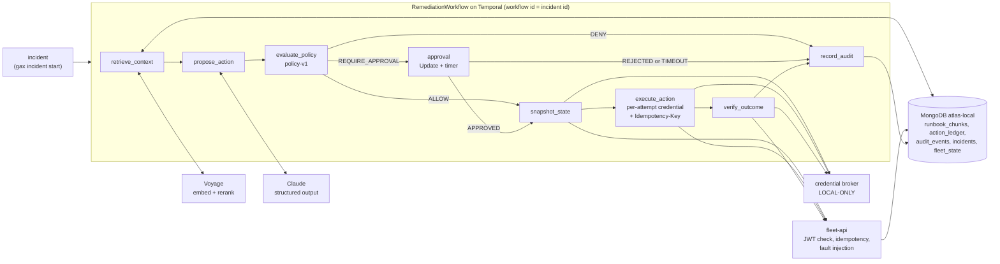

# Durable & Governed Agent Execution

An LLM is good at reading an incident and proposing a fix. It should not be the thing that decides whether the fix runs, holds the credentials, or is trusted to have done it exactly once. In this project, Claude proposes a remediation action for a simulated streaming platform. Deterministic, versioned policy code decides whether the action is allowed, needs a human approval, or is denied. Temporal executes it durably: each attempt gets its own short-lived credential and sends an `Idempotency-Key`, so a crash or a lost response cannot apply it twice. The result is then verified against the target system's state and written to an audit record. Retrieval (Voyage embeddings and rerank over MongoDB vector search) only gives the proposer context. It never authorizes anything.

## Architecture



Temporal history is the authority on execution. MongoDB holds retrieval data, domain state, the per-attempt `action_ledger` and the audit projection. fleet-api is a separate FastAPI process with its own state that stands in for the system being remediated. The LLM never sees credentials. Design: [docs/design.md](docs/design.md).

## Why each component exists

| Component | Role | Failure it protects against | Proven by |
|---|---|---|---|
| Temporal | Durable workflow, retries, approval timer | Worker crash mid-action; losing an approval wait; duplicate runs for one incident | demos `worker_kill`, `approval_timeout`, `duplicate_start`; `test_approval_timeout`, `test_duplicate_start_rejected` |
| MongoDB (atlas-local) | Vector index, action ledger, audit, fleet-api state and idempotency store | Losing per-attempt evidence (Temporal history keeps only the final attempt); no audit trail | demos `worker_kill` (ledger `[PENDING, REPLAYED]`), `mongo_down`; `test_ingest_skips_unchanged_and_search_finds_runbook` |
| Voyage | Embeddings and rerank for runbook retrieval | Proposer working without relevant runbooks; free-tier 429s | demo `voyage_429`; `test_429_backs_off_exponentially_then_succeeds`, `test_limiter_enforces_rpm`; rerank ordering in [m1-findings](docs/m1-findings.md) |
| Claude | Proposes one `ActionProposal` (Pydantic-validated structured output) | Free-text or out-of-schema actions reaching execution | demo `llm_malformed`; `test_malformed_proposal_needs_human_after_three_bounded_attempts`, `test_malformed_proposal` |
| Policy layer | Deterministic ALLOW / REQUIRE_APPROVAL / DENY by action, environment and parameters | An LLM-proposed destructive or out-of-range action being executed | demo `policy_deny`; `test_table_cells`, `test_scale_boundaries`, `test_policy_deny_schedules_no_execute_action` |
| Credential broker (LOCAL-ONLY) | Short-lived JWT per activity attempt, never stored in workflow state | Acting after access is revoked; credentials leaking into history, logs or the LLM | demos `credential_denied`, `credential_transient`; `test_staging_restart_verified_once_and_no_credential_in_history`, `test_revoke_denies_and_restore_allows` |
| fleet-api | Simulated target system with `Idempotency-Key`, JWT validation and fault injection | Double-applying a non-idempotent action on retry or after a lost response | demos `fleet_5xx`, `response_lost`; `test_idempotency_dedupe`, `test_concurrent_duplicates_apply_once`, `test_commit_then_drop_applies_exactly_once` |

## Quickstart

Prerequisites: Windows with PowerShell, Python 3.12 with a venv at `.venv`, Docker Desktop, Temporal CLI. `start-stack.ps1` looks for the CLI at `C:\Users\bhara\tools\temporal\temporal.exe` unless `TEMPORAL_CLI` is set.

`.env` (copy `.env.example`; values are never committed):

| Name | Needed for |
|---|---|
| `LOCAL_BROKER_SIGNING_KEY` | Required. At least 32 bytes. Signs and verifies LOCAL-ONLY credentials. |
| `VOYAGE_API_KEY`, `VOYAGE_BASE_URL` | Ingest, search, retrieval, `voyage_429` demo. Atlas-issued keys only work with `https://ai.mongodb.com/v1`. |
| `ANTHROPIC_API_KEY`, `ANTHROPIC_MODEL` | LLM proposals. Model defaults to `claude-sonnet-5`. |
| `KEYCARD_ZONE_URL`, `KEYCARD_CLIENT_ID`, `KEYCARD_CLIENT_SECRET` | Leave empty. If `KEYCARD_ZONE_URL` is set, `build_broker` raises `NotImplementedError` (no Keycard broker yet) instead of silently falling back to LOCAL-ONLY. |

```powershell
.venv\Scripts\python.exe -m pip install -e ".[dev]"
.\scripts\start-stack.ps1 -WithWorker
.venv\Scripts\gax.exe ingest
.venv\Scripts\gax.exe incident start --id INC-1 --env staging --target orders-consumer --summary "orders-consumer has 0 active members, lag climbing" --wait
.venv\Scripts\gax.exe audit INC-1
.venv\Scripts\gax.exe demo run all
.\scripts\stop-stack.ps1
```

- `start-stack.ps1` starts atlas-local (Docker), the Temporal dev server, fleet-api and, with `-WithWorker`, the worker. Temporal UI: http://localhost:8233.
- A second `ingest` embeds nothing: unchanged chunks are skipped by content hash.
- `demo run all` runs the eleven failure demos. The demos inject their proposals and skip retrieval, so they make no LLM or Voyage calls. The exception is `voyage_429`, which calls Voyage. Results go to `.gax/demo-results/`.
- `stop-stack.ps1` stops the worker, fleet-api, Temporal and the container.

Other commands: `gax search "<query>"`, `gax status <id>`, `gax approve|reject <id> --by <name>`, `gax broker revoke|restore|transient --action <action>`, `gax fleet faults|counters|reset|state`, `gax demo list`. `scripts\start-worker.ps1` and `scripts\stop-worker.ps1` manage the worker on its own (log `.gax\logs\worker.log`, launcher and real PID in `.gax\pids\worker.pid`). Tests: `.venv\Scripts\python.exe -m pytest`. The integration tests need atlas-local on `localhost:27017`.

## Failure matrix

Each row is a demo that runs against the live stack and checks its evidence (Temporal history, ledger, fleet-api counters, fleet state, worker log). Every demo also scans its workflow histories and worker log for credential material. Full details are in [docs/failure-semantics.md](docs/failure-semantics.md). The observed results below come from the recorded `gax demo run all` on 2026-09-29, where all 11 demos passed.

| Demo | What breaks | What the system does | Observed |
|---|---|---|---|
| `worker_kill` | Worker process hard-killed while `execute_action` is in flight | Temporal times out the attempt and retries on a new worker with the same Idempotency-Key | lastFailure `activity StartToClose timeout`, ledger `[PENDING, REPLAYED]`, `restart_count` 0 → 1 |
| `fleet_5xx` | fleet-api returns 500 twice | Retryable `FleetUnavailable` | ledger `[HTTP_500, HTTP_500, APPLIED]`, one state change |
| `response_lost` | fleet-api commits, then drops the response | Retry with the same key; fleet-api replays the stored response | ledger `[TRANSPORT_ERROR, REPLAYED]`, `restart_count` 0 → 1 |
| `credential_denied` | Grant revoked | Non-retryable `CredentialDenied`, run ends CREDENTIAL_DENIED; after restore, the same incident id reruns | 1 attempt, 0 restart requests; rerun VERIFIED |
| `credential_transient` | Broker unavailable twice | Retryable; credential requested fresh on every attempt | ledger `[CREDENTIAL_UNAVAILABLE ×2, APPLIED]`, 1 restart request |
| `policy_deny` | LLM-style proposal: prod `reset_consumer_offset` | Policy DENY before any fleet call | DENIED, fleet counters `{}`, prod offset 1000 → 1000 |
| `approval_timeout` | Nobody approves `pause_pipeline` | Durable timer ends APPROVAL_TIMEOUT; late approval rejected | nothing executed; reject path executes nothing; approve path executes once |
| `llm_malformed` | Proposal with action `drop_topic` | Pydantic validation fails, run ends NEEDS_HUMAN | 0 fleet requests |
| `voyage_429` | Voyage free-tier rate limit exhausted | Client backoff 2/4/8 s plus a sliding-window limiter | real 429s, then embed and rerank 200, run VERIFIED |
| `mongo_down` | atlas-local stopped after approval | Mongo errors become compact retryable `MongoUnavailable` | `snapshot_state` attempt 3, then VERIFIED with an audit record |
| `duplicate_start` | Same incident id started while running and after completion | `ALLOW_DUPLICATE_FAILED_ONLY` rejects both | exit 2 twice, one run, one state change |

## Key engineering findings

- **Oversized activity failures were found only by the live demos.** The Temporal server replaced lastFailure with `"Failure exceeds size limit."` because the Python SDK serialized the full httpcore → httpx exception chain (and pymongo's `ServerSelectionTimeoutError`). The mock-transport integration test did not reproduce it. The fix is to raise transport errors `from None` and turn Mongo errors into a compact `MongoUnavailable`. See [failure-semantics finding 1](docs/failure-semantics.md#findings).
- **An idempotency key and a ledger are both needed.** Temporal history records only the final attempt's `ActivityTaskStarted`. A killed attempt shows up only as `lastFailure` on the next one. So every attempt writes its own `action_ledger` row, and fleet-api stores the response under `<workflow_id>:execute_action` in the same Mongo transaction as the state change. See [m0-findings finding 2](docs/m0-findings.md#findings) and demos `worker_kill` and `response_lost`.
- **Authorization has two layers.** A credential issuer decides who may get a token for a resource. It never sees the proposal, so it cannot express "`scale_consumer` only for 1..10 replicas" or "DENY in prod, approval in staging". Those rules are in versioned policy code. The credential is re-issued on every attempt, so a revocation stops the next retry. See [ADR 0001](docs/decisions/0001-authorization-layering.md).
- **Windows process-handle inheritance hung the start script.** `Start-Process -RedirectStandardOutput` made the detached Temporal and fleet-api processes inherit the caller's pipe, so a piped `start-stack.ps1` never returned. They are now launched through `cmd.exe /c ... 1>out 2>err`, which inherits no handles. See [m1-findings Part 0](docs/m1-findings.md#part-0). A related trap: `.venv\Scripts\python.exe` is a launcher, so kill demos target the real PID the worker prints.

## Limitations and what I would change for production

- **LOCAL-ONLY credential broker, not Keycard.** The account is pending ([ADR 0002](docs/decisions/0002-keycard-integration.md)). The broker implements the interface Keycard would satisfy and signs JWTs with a local key. None of this counts as Keycard verification.
- **Single-node atlas-local and the Temporal dev server** (SQLite file under `.gax/`). There is no replication, HA or persistence tuning.
- **fleet-api `/admin/*` endpoints are unauthenticated.** They exist for fault injection and resets, and only listen on `127.0.0.1`.
- **The corpus is synthetic.** It has 14 invented runbooks and 54 chunks ([corpus/README.md](corpus/README.md)).
- **Failed retrieval does not stop the run.** The workflow records `retrieval_error` and proposes without context. Policy still gates the action.
- **The idempotency key is scoped to the incident id, not the run.** Rerunning a failed incident id whose action already committed replays the stored response instead of applying again.
- **atlas-local exits with code 137 on `docker stop`**, even though the stop returns in about 3 s. The cause was not investigated.
- **Not verified** (from the findings docs): malformed output from the real model (structured outputs constrain decoding, so the bounded-retry path is covered by a test double); Mongo down during or after `execute_action`'s commit, or during `record_audit`; Mongo down for longer than the retry budget; a worker kill before the request reaches fleet-api; a Temporal server crash; activity heartbeating; anything Keycard-related.

For production I would put the credential layer on Keycard (or another workload-identity issuer) with fleet-api validating issuer-signed tokens. I would also run a replicated MongoDB and a real Temporal cluster, authenticate the admin endpoints (or remove them), and scope idempotency keys per run where re-execution after a failed run is intended.

## Credit

This project was inspired by concepts from [mongodb-developer/mdb-temporal-keycard](https://github.com/mongodb-developer/mdb-temporal-keycard). That reference architecture combines Temporal, MongoDB Atlas, Voyage and Keycard for a durable RAG ingestion pipeline and a read-only research agent, with per-activity just-in-time credentials. The differences in this project:

- It executes **write actions** against an external system.
- **Policy is evaluated at the parameter level** by deterministic, versioned code before anything runs.
- Some actions need **human approval** with a durable timeout.
- **Side effects are idempotent**, keyed per incident, with a per-attempt ledger.
- **Outcomes are verified** against the target system's state.
- Eleven **failure demos** check their own evidence.

## Status

This is a personal project, built in September 2026. It runs locally only. Keycard integration is pending, and all credential behaviour described here uses the LOCAL-ONLY broker. Phase history and observed results: [m0-findings](docs/m0-findings.md), [m1-findings](docs/m1-findings.md), [failure-semantics](docs/failure-semantics.md), [claims audit](docs/claims-audit.md), [demo script](docs/demo-script.md).
